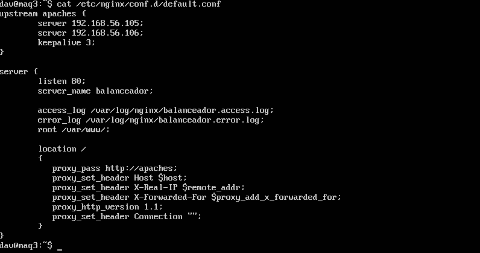
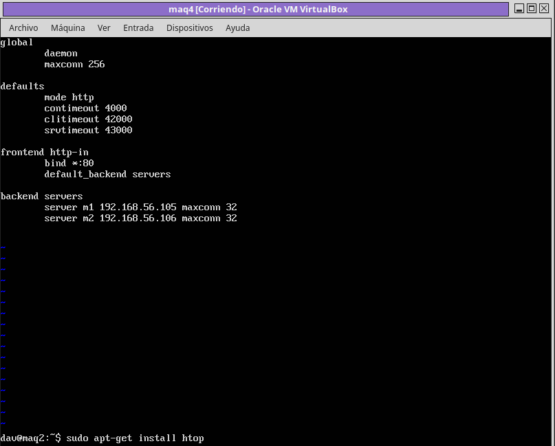
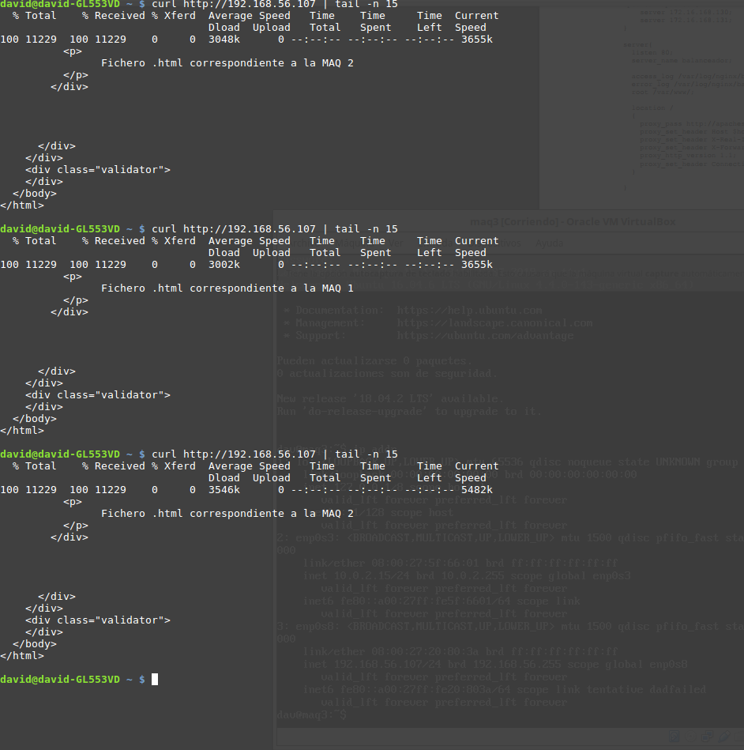
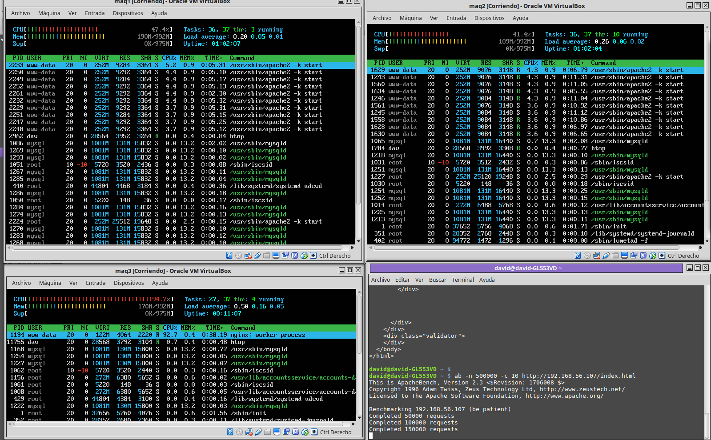
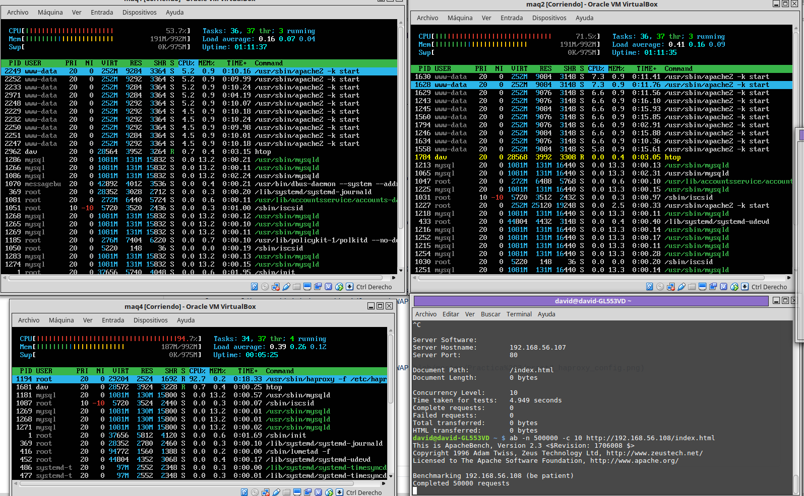

# Práctica 3 de SWAP
Integrantes del grupo: David Luque y Jesús Rodríguez

## Objetivo
Configurar haproxy y nginx como balanceadores de carga. Comprobar que se distribuye la carga usando htop en los servidores.

## Procedimiento
Para la realización de la práctica hemos utilizado dos máquinas virtuales maq1 (192.168.56.105) y maq2 (192.168.56.106) como servidores que procesan peticiones, así como maq3 (192.168.56.107) corresponde al balanceador nginx y maq4 (192.168.56.108) para el balanceador haproxy.

### Configuración de nginx

Tras instalar ngix (sudo apt-get install nginx), hemos modificado el archivo de configuración /etc/nginx/conf.d/default.conf
La configuración de nginx usada ha sido: 

### Configuración de haproxy

Tras instalar haproxy (sudo apt-get install haproxy), modificamos el archivo /etc/haproxy/haproxy.cfg.
La configuración de haproxy ha sido:

## Prueba sometiendo a la granja web a una carga alta

Antes de nada hemos probado el funcionamiento de nginx y haproxy, para ello hemos cambiado el index.html de cada servidor (maq1 y maq2) y accedido a la granja web (mediante la dirección del balanceador) hemos comprobado que alternamente nos sirve los index.html de los diferentes servidores:

(Solo hemos mostrado la prueba con nginx ya que haproxy es exactamente igual)

Para ello hemos empleado la herramienta ab (Apache Benchmark), primero hemos probado con nginx:

ab -n 500000 -c 10 http://192.168.56.107/index.html

La carga se distribuye correctamente. Lo hemos comprobado usando el comando htop:

Y del mismo modo con haproxy (ab -n 500000 -c 10 http://192.168.56.108/index.html), con htop lo comprobamos:

